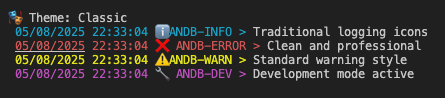
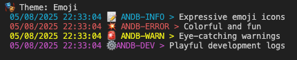
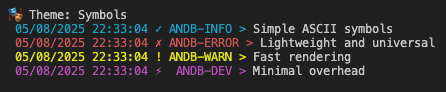
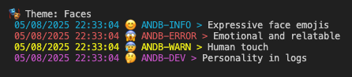
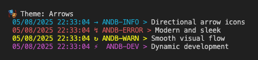

# @andb68/logger - Simple Color Logger

A lightweight Node.js logging utility with color, icons support, time formatting, file logging capabilities, and customizable icon themes.

## Features

- 🎨 **Color-coded logs** for different log levels
- ⏰ **Automatic timestamp** with GMT+7 timezone by default
- 📁 **File logging** with automatic directory creation
- 🔧 **Development mode** filtering
- 🏗️ **Singleton pattern** for consistent logging across your app
- 🎭 **10 Icon themes** for visual customization

## Installation

```bash
npm install andb-logger
```

## Quick Start

```javascript
const logger = require('andb-logger').getInstance({
  mode: 'development',
  dirpath: __dirname,
  logName: 'MYAPP',
  theme: 'emoji'  // Choose your icon theme
});

logger.info('Server started on port 3000');
logger.error('Database connection failed');
logger.warn('Deprecated API called');
logger.dev('Debug info - only shown in dev mode');
```

## Icon Themes

AndbLogger comes with 10 pre-built icon themes to make your logs more visual and intuitive:

### Available Themes

#### Classic Theme

*Traditional logging icons - clean and professional*

#### Emoji Theme  

*Expressive emoji icons - colorful and fun*

#### Symbols Theme

*Simple ASCII symbols - lightweight and universal*

#### Faces Theme

*Expressive face emojis - emotional and relatable*

#### Arrow Theme

*Directional arrow icons - modern and sleek*

**Other themes include:**
- **Circles** - Circular indicators (minimal and clean)
- **Squares** - Square block icons (geometric and structured)  
- **Tech** - Technology-focused icons (perfect for dev environments)
- **Nature** - Natural element icons (organic and calming)
- **Minimal** - Single letter indicators (ultra-minimal and fast)

### Theme Usage

#### Set Theme on Initialization
```javascript
const logger = require('andb-logger').getInstance({
  theme: 'tech'  // Use tech theme
});
```

#### Change Theme Dynamically
```javascript
logger.setTheme('emoji');  // Switch to emoji theme
logger.setTheme('minimal'); // Switch to minimal theme
```

#### Theme Examples

**Classic Theme (Default):**
```
 ℹ️  MYAPP-INFO - 20/01/2024 10:31:08 > Server started
 ❌ MYAPP-ERROR - 20/01/2024 10:31:08 > Connection failed
 ⚠️  MYAPP-WARNING - 20/01/2024 10:31:08 > Deprecated API
 🔧 MYAPP-DEV - 20/01/2024 10:31:08 > Debug info
```

**Tech Theme:**
```
 💻 MYAPP-INFO - 20/01/2024 10:31:08 > Server started
 🔥 MYAPP-ERROR - 20/01/2024 10:31:08 > Connection failed
 ⚡ MYAPP-WARNING - 20/01/2024 10:31:08 > Deprecated API
 🔧 MYAPP-DEV - 20/01/2024 10:31:08 > Debug info
```

**Minimal Theme:**
```
 i MYAPP-INFO - 20/01/2024 10:31:08 > Server started
 e MYAPP-ERROR - 20/01/2024 10:31:08 > Connection failed
 w MYAPP-WARNING - 20/01/2024 10:31:08 > Deprecated API
 d MYAPP-DEV - 20/01/2024 10:31:08 > Debug info
```

## API Reference

### Configuration

```javascript
const logger = require('andb-logger').getInstance({
  mode: 'production',        // 'production' | 'development' | 'dev'
  dirpath: __dirname,        // Directory for log files
  logName: 'logger',         // Logger name prefix
  theme: 'classic'           // Icon theme (default: 'classic')
});
```

### Log Methods

#### `logger.info(...args)`
Log info level messages (cyan color)

```javascript
logger.info('User logged in', { userId: 123 });
// logger-INFO - 20/01/2024 10:31:08 > User logged in { userId: 123 }
```

#### `logger.error(...args)`
Log error level messages (red color)

```javascript
logger.error('Database connection failed', error);
// logger-ERROR - 20/01/2024 10:31:08 > Database connection failed Error: ...
```

#### `logger.warn(...args)`
Log warning level messages (yellow color)

```javascript
logger.warn('Deprecated method called');
// logger-WARNING - 20/01/2024 10:31:08 > Deprecated method called
```

#### `logger.dev(...args)`
Log development messages (magenta color) - only shown in development mode

```javascript
logger.dev('Debug info', { requestId: 'abc123' });
// logger-DEV - 20/01/2024 10:31:08 > Debug info { requestId: 'abc123' }
```

#### `logger.setTheme(theme)`
Change the icon theme dynamically

```javascript
logger.setTheme('emoji');  // Switch to emoji theme
logger.setTheme('tech');   // Switch to tech theme
```

#### `logger.write(text, filename)`
Write log to file

```javascript
logger.write('Custom log message', 'api');
// Creates: logs/api-DESKTOP-F2RK900-20-1-2024.log
```

**Parameters:**
- `text` (string): Text to write
- `filename` (string, optional): File name prefix (default: 'combined')

## Examples

### Basic Usage with Theme

```javascript
const logger = require('andb-logger').getInstance({
  theme: 'faces'  // Use expressive face icons
});

logger.info('Application started');  // 😊
logger.error('Something went wrong'); // 😱
logger.warn('This feature is deprecated'); // 😰
logger.dev('Debug information'); // 🤔
```

### Theme Switching

```javascript
const logger = require('andb-logger').getInstance();

// Start with classic theme
logger.info('Server starting...');

// Switch to tech theme for development
logger.setTheme('tech');
logger.dev('Debug mode enabled');

// Switch to minimal for production
logger.setTheme('minimal');
logger.info('Server ready');
```

### Environment-Based Themes

```javascript
const logger = require('andb-logger').getInstance({
  mode: process.env.NODE_ENV,
  theme: process.env.NODE_ENV === 'development' ? 'emoji' : 'minimal'
});
```

## Log File Structure

Log files are created in the `logs/` directory with the following naming pattern:
```
{filename}-{hostname}-{day}-{month}-{year}.log
```

Example: `combined-DESKTOP-F2RK900-20-1-2024.log`

## Timezone Support
AndbLogger supports flexible timezone configuration to ensure accurate timestamps in your logs. By default, it uses GMT+7, but you can customize it

## License
MIT

